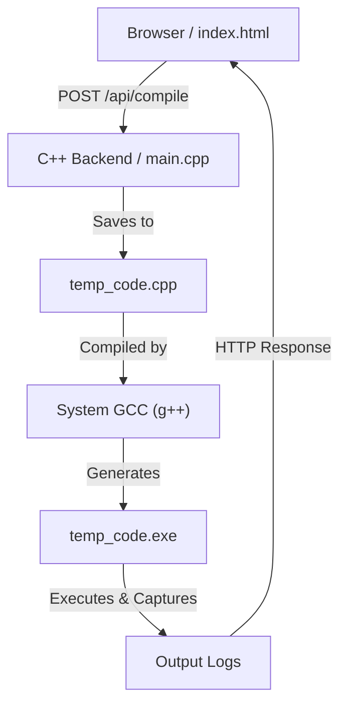

# 🚀 Project Y: Modern C++ Web IDE & Compiler Suite

Welcome to **Project Y**, a powerful and lightweight web-based environment for writing, compiling, and executing C++ code directly from your browser. This project bridges the gap between low-level C++ socket programming and modern web interfaces.

---

## 🏗️ Architecture Overview

Project Y consists of a **C++ Backend** (acting as a multi-threaded web server) and a **Modern Web Frontend**.

---

## 📁 Project Structure

| File / Folder | Description |
| :--- | :--- |
| **`main.cpp`** | The heart of the project. A custom HTTP server built with WinSock2 that handles requests and manages the compilation lifecycle. |
| **`ui/`** | Contains the frontend assets. |
| &nbsp;&nbsp;└── `index.html` | A premium, glassmorphic IDE interface with a code editor and integrated terminal. |
| **`temp_code.*`** | Temporary files used during the compilation and execution phase. |
| **`version 1/`** | An educational sub-project containing a **Custom Internal Compiler** (Lexer, Parser, and AST engine). |
| **`httplib.h`** | (Optional) A high-level HTTP library, kept for reference or future upgrades. |

---

## 🔍 Line-by-Line Code Breakdown (`main.cpp`)

Since you want to understand exactly how the "Engine" works, here is a detailed breakdown of the code in `main.cpp`.

### 1. The Setup (Headers & Libraries)
*   **Lines 1-15**: These are "tools" our program needs.
    *   `winsock2.h` & `ws2tcpip.h`: Allow the program to talk to the internet (Networking).
    *   `iostream` & `fstream`: Allow the program to print text to the console and create/read files on your computer.
    *   `#pragma comment (lib, "Ws2_32.lib")`: This tells the computer to use the "Windows Socket" library—it's like plugging in the internet cable.

### 2. The Compiler Engine (`runGccCompiler`)
*   **Lines 18-35 (The Saver)**: This function takes the text you typed in the browser and saves it as a file named `temp_code.cpp`. It ensures the code is formatted correctly so the compiler doesn't get confused.
*   **Lines 37-61 (The Builder)**: This is the most important part! It runs a "background command" `g++ temp_code.cpp -o temp_code.exe`. 
    *   If you made a mistake (like forgetting a `;`), it captures those errors into a text file and sends them back to the browser.
*   **Lines 63-84 (The Runner)**: If everything is okay, it runs the newly created `temp_code.exe`. It "listens" to the result and prepares to send it back to your screen.

### 3. The Web Server Logic (`handle_client`)
*   **Lines 87-100**: This code "listens" to the web browser. It reads the small "Hello" message (HTTP Header) the browser sends when you visit the page.
*   **Lines 110-127 (The File Server)**: When the browser asks for the webpage (`GET /`), this code looks into the `ui/` folder, finds `index.html`, and sends it to the browser so you can see the IDE.
*   **Lines 128-154 (The API)**: When you click **"Run Code"**, the browser sends a **POST** request. This code extracts your C++ code from that request and feeds it into the `runGccCompiler` function we talked about above.

### 4. The Starting Point (`main()`)
*   **Lines 174-191**: This is where the program starts. It sets up the server's "address" and "port" (8080).
*   **Line 198**: A handy command that **automatically opens your browser** to `http://localhost:8080` so you don't have to type it manually.
*   **Lines 200-211**: A "Loop" that never ends. It tells the server to stay awake and wait for you to click "Run" at any time.

---

## 🧠 The Logic of a Compiler (Educational)

If you look into the `version 1` folder, you will see a different type of `main.cpp`. Instead of using an external tool like `g++`, it works using three core concepts:

1.  **The Lexer (Scanner)**: It reads your text and turns things like `32 + 5` into chunks: `[Number: 32]`, `[Symbol: +]`, `[Number: 5]`.
2.  **The Parser**: It understands the "Grammar" of math. It knows that `*` (Multiplication) should happen before `+` (Addition).
3.  **The AST (Tree)**: it builds a map of your code. For `3 + 5`, it puts the `+` at the top and the numbers at the bottom.

---

### 🌟 Summary for Beginners
*   **`main.cpp`** = The Manager. It handles the website and talks to your computer.
*   **`ui/index.html`** = The Face. It's the beautiful screen you see.
*   **`g++`** = The Brain. It's the actual tool that turns C++ text into a working program.

---

## 🚦 How to Run Everything
1.  Open your terminal.
2.  Compile the manager: `g++ main.cpp -o main -lws2_32`
3.  Run the manager: `.\main.exe`
4.  Happy Coding!
